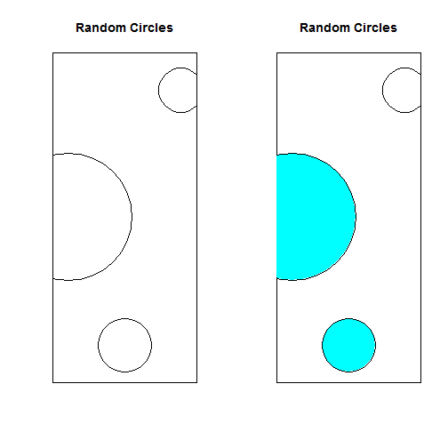

App Pitch
========================================================
author: Jason Miller
date: 24-10-2016

This presentation is the second part of a peer assessed assignment for the Coursera Data Products course. The first part required the creation of a Shiny application and deploying it on Rstudio's servers. This second part asked students to use Slidify or Rstudio Presenter to prepare a reproducible pitch presentation about the above application.

The App
========================================================

Given that the target user includes novice users, it was important to consider the following:

- mathematical or statistical complexity of the instruction(s)
- usefulness or fun element
- asthetic layout
- complexity of background process to enable quick running of the app

The App (continued...)
========================================================

As a result, the user is shown a plot of empty circles and asked to guess the number of circles. This is a fun app that engages the users perceptive skills and gives a feeling of "winning" when it is done correctly.

In the example we illustrate here, 3 circles are drawn and a second plot is created to illustrate the outcome of a guess of "2".

The App (continued...)
========================================================

Review
========================================================

This application is clearly a very simple one that is both easy to use and udnerstand. It may however have very wide-reaching application as it can be used to train reaction time and perception. Further, with some simple modification, it could also be turned into a memory game or be used simply to great aestheticly pleasing designs that could be used as art.
